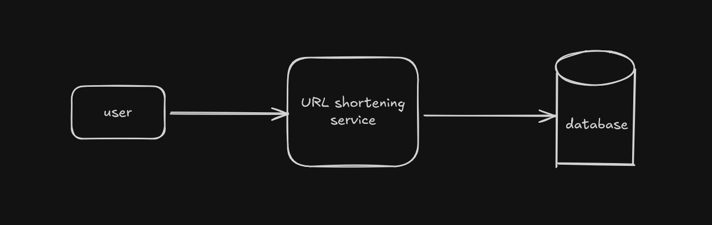
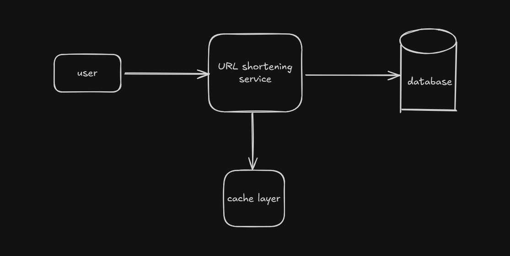

# Scalable Url Shortener

I am going to document all the steps that i take while building this application.

first let's talk about all the requirements that i expect from this project.
- URL Shortening: users should be able to input a long url and receive a short unique url in return.
- URL redirection: When users access a shortened URL, the service should redirect them seamlessly to the original URL with minimal delay.

some other things that i want to talk about - to be implemented in the future.
- the application should have some feature to let user delete their short urls from the database, although for this i will need the users to create their accounts first, so for now i am sticking with time based deletion or maybe no deletion at all.
- let users create custom urls(if available).
- analytics to measure site engagement.

let's talk about scale requirements
- read:write ratio: 100:1
- write requests per day: 1M
- assuming that each entry is 500 bytes.

## API Endpoints:

1. URL shortening endpoint:
    
    POST api/v1/shorten

    This endpoint accepts a long URL and returns a shortened version.
    
    Request body:
    ```json
    {
        "longUrl": "your long url here"
    }
   ```

   Request body:
    ```json
    {
        "shortUrl": "you will recieve your short url in the response",
        "longUrl": "the original long url that you posted"
    }
    ```

2. URL redirection

    GET api/v1/urls/{shortUlr}

    redirect to the original url

    Response body:

    ```md
         Returns HTTP 302 with the "Location" header set to the original URL.
    ```

## High Level Design

### URL shortening
The url shortening service generates a unique short url for the long url provided by the user.

the high level diagram has three main components:


- **user**: the frontend application sends a POST request to the server with the long url to fetch the shortened url.
- **url shortening service**: the system receives the request and it generates the short url in the following steps:
    - generate a unique short url(will discuss the techniques later).
    - store the short url - long url map in the database.
- **database**: use a database for storing the short url - long url mapping.

### URL redirection
The url redirection service returns the original long url using the short url.

the high level diagram has four main components:


- **user**: the frontend application sends a GET request to the server to fetch the original url.
- **url redirection service**: the system receives the request and goes through the following procedure to generate a response:
    - first the service checks the cache for the long url, if it finds it then return the long url but if not then check the database
    - if the database has an entry then return the original long url but if not then throw an error.
- **cache**: we implement this layer to reduce latency and offload requests from the database, this is an in-memory store and is much faster compared to disk-based databases.
- **database**: in case the url is not found in the cache, then look for it in the database.

## High level deep dive:
let's talk about some stuff first and then i will continue with scalability.

### What are the properties of shortUrl and how can we generate it.
the short url should be unique and should be as short as possible.

for our use case we are assuming that the system will receive 1M write requests per day, assuming that the data is persisted for 10years, the total number of entries our database should be able to store is 1M * 365 * 10 which is 3.65B shortUrls.

let's assume we are using Base 62 characters for creating short urls, in that case the short url should be of at least 7 characters which is capable of storing around 3T entries.

#### How should we generate short urls?
1. Using auto-increment integer id generation
    we can use integer id's to generate short urls.    
    
    we can use the auto-increment integer id feature of the databases to generate unique integer id which then can be used to generate the corresponding short url,
    although this won't work if we shard the database, so the best option is to use a global id generator.
    
    the easiest way to use a global generator is to use a redis server for id generation, since redis is single threaded by nature we won't even have to worry about synchronization,
    although it introduces a single-point-of-failure in our system, so we might want to fix it.
    
    we can have more than one redis servers, in which the possibility of all redis server going down at once is reduced, 
    but how do we get all these redis server to agree to a "current" id, we can use step/offset strategy like the ticket-server pattern for this.
    
    Instead of having multiple servers try to agree on the "current" number (which is hard), you assign them different starting points and a step size equal to the count of servers.
    
    If you have 2 Redis Servers:
    
    - Redis A: Starts at 1, increments by 2. (Generates: 1, 3, 5, 7...)
    - Redis B: Starts at 2, increments by 2. (Generates: 2, 4, 6, 8...)
        
    next we can use batching, to avoid hitting the redis server every time a request arrives.
    
    Even with the strategy above, hitting Redis for every single URL creation is slow (network latency). A standard industry optimization is Batching.
    
    - Your Application Server (Web Server) asks Redis: "Give me a range of 1,000 IDs."
    - Redis does INCRBY counter 1000 and returns the value (e.g., 50,000).
    - The Application Server now knows it "owns" IDs 49,001 to 50,000.
    - It assigns these IDs in memory to incoming requests without talking to Redis again until it runs out.
    
    with these strategies we can generate integer id, which increase by a certain amount (+1), and use it to generate short url.

2. Distributed unique integer id (Twitter snowflake)
   Generate a globally unique 64/128-bit ID per request using a time+worker scheme and then encode in base62.

    we can use Twitter snowflake strategy for that -> timestamp | datacenter | machine | sequence

3. Hash based short url generation
    In this technique we use hash algorithms like SHA-256/MD5 to hash a long url and then we take the first L(length of the short url required) characters
    if collision occurs we can keep adding salt until we finally get a unused short url.

4. Random Slug
    Another approach is to generate slug randomly, in case a collision happens we can just generate it again until we get a new unused slug
    the probability of collision though is very low.

#### How do we scale the system?

for scaling we need to identify the bottleneck of the system, in our case that would be
1. database -> we have 3.65B records in a year, one instance of database might struggle with it.
2. database lookups -> we have around 100M read operations per day, we have to ensure that the system can support this high traffic with minimal latency.

the scaling portion will revolve around the above two

##### Scaling our Database
1. scaling for write operations
    Since we are dealing with billions of rows, a single instance of database might struggle with disk-space and IOPS(Input/Output operations per second), so a better way is to shard the database reducing request overload
    
    we have to design the database in such a way that it supports 1M write operations a day that is around 12 write operations per second, which is not a lot, but the request distribution is not uniform and during rush hours we can get 10X
    more write operations, so we need to be prepared for that.
    
    we can use hash-based sharding, we hash the short url for our application and as to why short url and not long url is because the read operation is `GET: api/v1/urls/{shortUrl}`, so we will need to query all the shards of the database, which will be tough
    
    to determine which shard we should write we can use consistent hashing (will try to implement it next), basically what happens is that we hash the short url and find the nearest shard key while traveling in a clockwise directions on the hash search space.
    
    with this our database should be able to handle the required amount of write operations.

2. scaling for read operations

    the number of read operations are much larger than the number of write operations, in a second we have to deal with around 1200 read operations, which can be as big as 12000 during rush hours.
    
    we can use database replication(Master-Slave), since the number of read requests in larger compared to write requests we separate reads and writes, the Master database handle all the write operations and the slave database handles all the read operations
    
    apart from that we can also use caching, database operations are heavy, we can use caching to avoid querying the database for all the read requests.
    
    we can have a cache that stores the data in the form of <shortUrl, longUrl> mapping, we can use the cache-aside policy(check the cache first, if not present check the database and update cache) and eviction policy like LRU for our use case.
    
    if we have 100M request and cache 20% of the requests, then 20M * 500bytes = 10GB, this is easily manageable on a single instance but we use multiple for resilience.
    
    **not needed** for our system but something that i wanted to talk about: what will we do if say some bot generates millions of read requests with random shortUrl, our system will
    go something like this cache -> miss -> check database -> miss, which can overwhelm our system, how do we fix this, we can use bloom-filters for this, a bloom filter is a probabilistic memory structure that tells 
    us if a url is **possibly present** or **absolute not present**, if the bloom filter says that the url is absolutely not present we can straight up reject the request, safe-guarding our system in such case.


